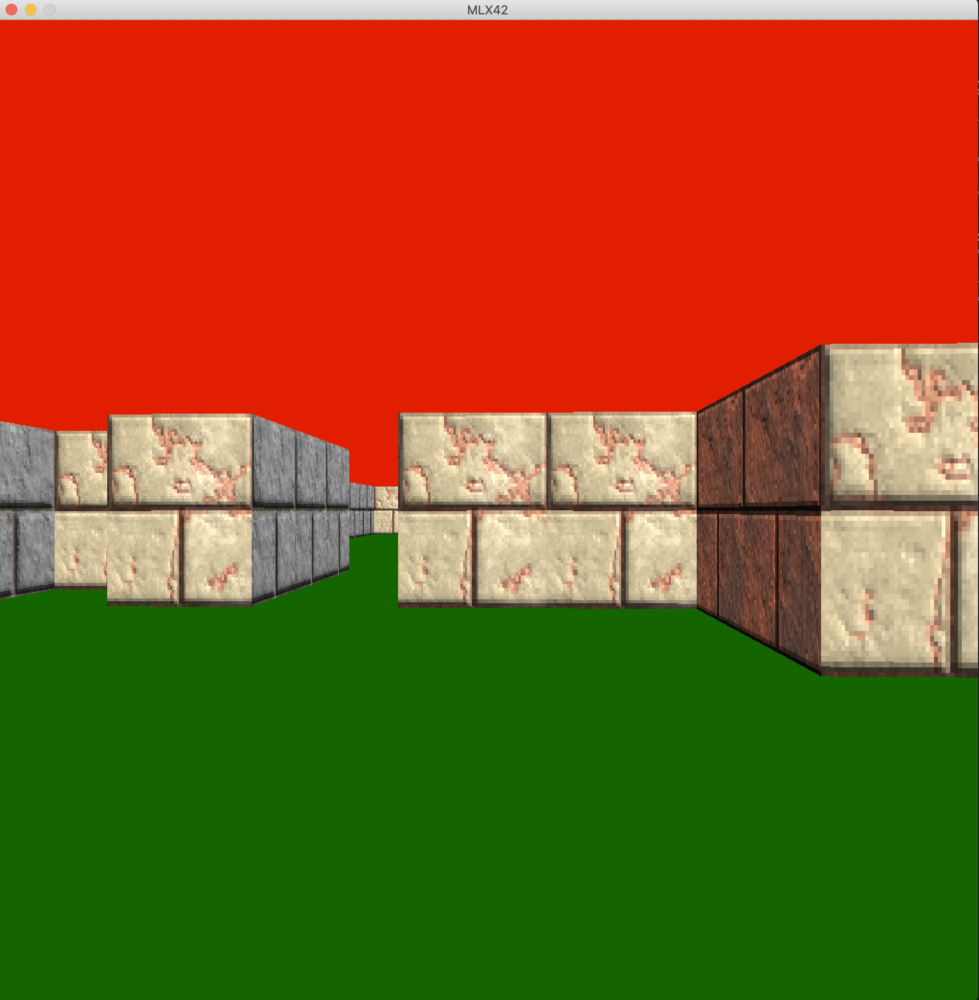
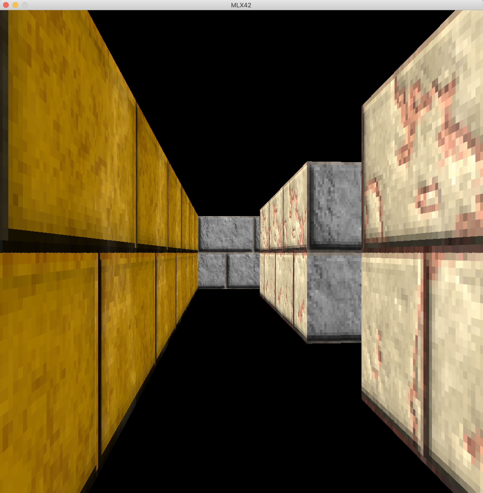
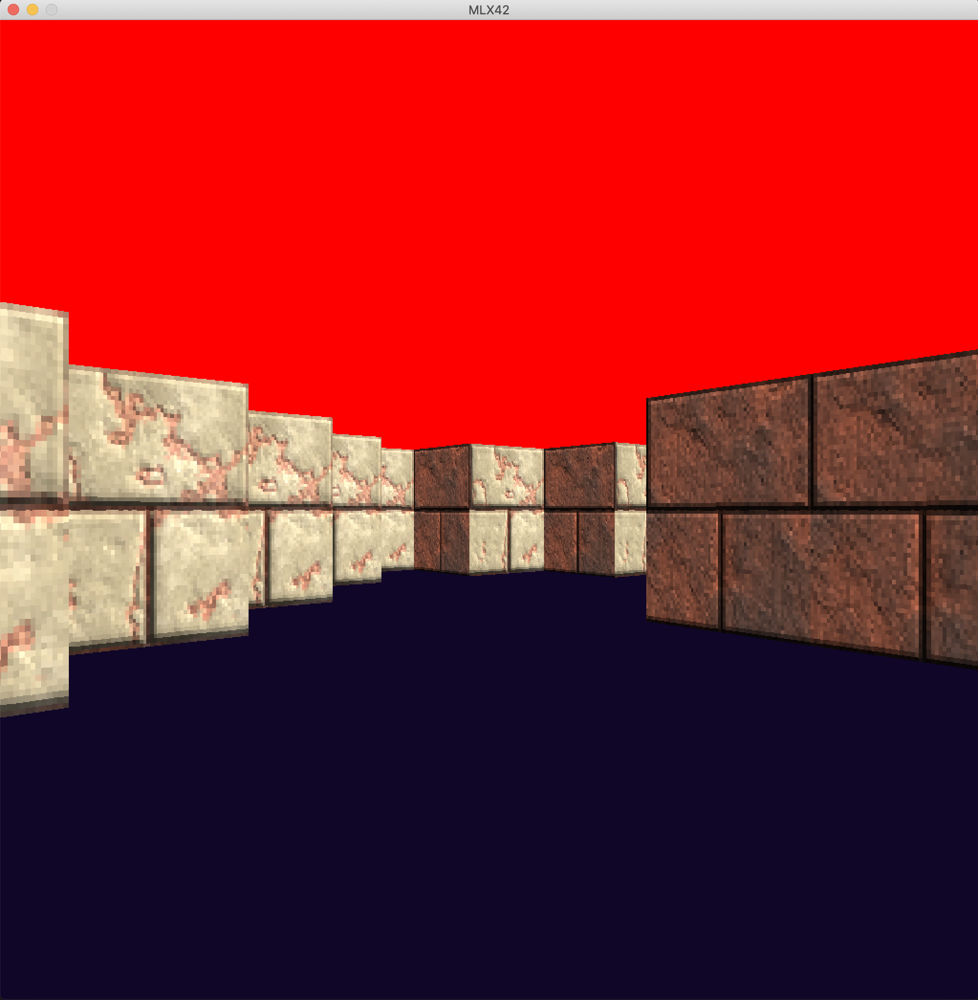

# cub3D

cub3D is a 3D game engine inspired by the classic game Wolfenstein 3D. It is designed to render a maze-like environment and simulate a first-person perspective, providing an immersive gaming experience.

## Features

- Real-time 3D rendering of a maze environment.
- First-person perspective movement and controls.
- Collision detection to prevent walking through walls.
- Customizable map system for creating unique mazes.
- Support for texture mapping to enhance visual appeal.

## Getting Started

### Prerequisites

- A C compiler (e.g., GCC or Clang)
- Make build automation tool
- MLX42 library for graphics and window management
- GLAD library for OpenGL loading
- lodepng library for loading PNG images

### Installation

1. Clone the repository with submodules:
`git clone --recurse-submodules https://github.com/DeRuina/cub3D.git`

2. Navigate to the project directory:
 `cd cub3D`

3. Build the project using Make:
 `make`

### Running the Game

After building the project, you can run the game engine with the following command:

`./cub3D [map name]`

## Controls

- `W` - Move forward
- `S` - Move backward
- `A` - Strafe left
- `D` - Strafe right
- `Arrow keys` - Look around
- `ESC` - Exit the game

## Custom Maps

You can create your own maps by editing the map files in the `maps` directory. Refer to the map documentation for the format and guidelines.

## Acknowledgments

- Thanks to the creators of the MLX42 library for providing the graphics backend.
- Shoutout to the Wolfenstein 3D team for the inspiration.

## Authors

- [@DeRuina](https://github.com/DeRuina)
- [@Stte](https://github.com/Stte)
